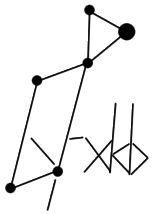

**This repo has been all-but abandoned in favor of using a hardware keyboard running [QMK](https://github.com/qmk/qmk_firmware). This layout heavily inspired the layout I made for my Ergodox (Ergodone clone) keyboard which can be found in the QMK repo [here (keymap.c)](https://github.com/qmk/qmk_firmware/blob/master/keyboards/ergodone/keymaps/vega/keymap.c).**



---

# LYRxkb

LYRxkb is a new Dvorak or Qwerty based keyboard layout for linux specifically designed
for programming without a massive learning curve. It was heavily inspired by the German [Neo layout](http://neo-layout.org).

The layout is generated using layoutgen.py which can be used to relatively easily adapt the project into different bases (Qwerty, Dvorak, etc) or change minor things in the layout, such as the layer order (which mod key does what).

While in development all of this will be hard coded into the file (though mostly at the beginning).

Planed Help file (using as a road map for now)

Lyrxkb is also capable of kinda janky unicode -> qmk keymap.c file generation. Use at your own risk.

```
-p -- print the keymap to the standard output
-v -- list how the cli options set variables
-u -- make as much output unicode as possible
-nu -- output with raw unicode text, without
 converting to Uxxxx format for file
-l -- set layout, valid options are QWERTY and DVORAK
-c -- set number of layers
-o -- set order of layers, input by a list of numbers, comma seprated
 list provided below
-h -- list this output
--help -- list this output

1.  lowercase
2.  uppercase
3.  brackets
4.  greek lowercase
5.  greek uppercase  
6.  math symbols
7.  tengwar lowercase
8.  tengwar uppercase
9.  small-caps
10.  upsidedown text
11.  Blackboard bold
```

using the old install scripts requires xmlstarlet to be installed
